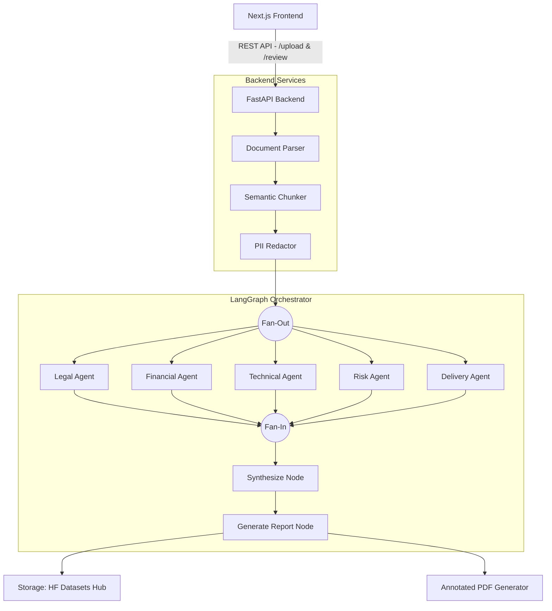

# SOWnia: AI-Powered Multi-Agent SOW Review System

## 1. Business Problem & Solution

**The Business Problem:**
Reviewing Statements of Work (SOWs) is traditionally a highly manual, time-consuming, and error-prone process. It requires coordination across multiple domain experts (Legal, Finance, Technical, Risk, and Delivery) who must comb through lengthy documents to identify hidden risks, scope creep, unrealistic timelines, and unfavorable terms. This manual review cycle often takes days or weeks, causing delays in project kick-offs and exposing the business to potential contractual and financial liabilities if critical issues are missed.

**The SOWnia Solution:**
SOWnia is an automated, AI-powered multi-agent review system designed to replace the multi-day manual review cycle with a seamless pipeline that completes in minutes. By leveraging specialized AI agents tailored to distinct domains, SOWnia provides a comprehensive, structured, and traceable risk assessment of any SOW document. It ensures speed, accuracy, and consistency while freeing up human experts to focus on high-value mitigation strategies rather than tedious document reading.

---

## 2. Detailed Features

- **Multi-Agent Expert Review:** Utilizes 5 specialized AI agents (Legal, Financial, Technical, Risk, and Delivery) that review the document concurrently from different perspectives.
- **Parallel Execution:** Employs a fan-out architecture to run all 5 agents simultaneously, drastically reducing the overall review time.
- **Multi-Format Document Parsing:** Seamlessly processes both PDF and DOCX files, preserving document structure, text, and page numbers.
- **Traceable Findings & Annotated PDFs:** The system quotes the exact problematic text from the SOW (`source_text`). Users can download an **Annotated PDF** where findings are highlighted in risk-coded colors (🔴 High, 🟡 Medium, 🟢 Low) with pop-up sticky notes detailing the issue and recommendation.
- **PII Protection (Defense-in-Depth):** Automatically detects and redacts Personally Identifiable Information (PII) such as emails, phone numbers, SSNs, and names before sending text to external LLMs.
- **Structured JSON Outputs:** AI responses are strictly validated into structured Pydantic schemas, ensuring consistent formats for findings, risk levels, and confidence scores.
- **Dynamic Risk Scoring:** Automatically synthesizes findings across all agents to calculate a weighted, overall risk score (0-10) and flags low-confidence reviews for human attention.
- **Professional PDF Reports:** Generates polished, downloadable summary reports (via WeasyPrint) for executive stakeholders.
- **Historical Dashboard & Analytics:** Tracks past reviews, providing a centralized dashboard for risk analytics and historical record keeping.

---

## 3. Architecture & Entire Workflow

### System Architecture

### End-to-End Workflow

1. **Upload:** The user uploads a PDF or DOCX file via the Next.js frontend.
2. **Parsing & Chunking:** The FastAPI backend extracts text and uses a `SemanticChunker` to break the document into manageable, ~1000-token chunks based on headings and paragraphs.
3. **Redaction:** The `PIIRedactor` scrubs sensitive information using regex and pattern matching.
4. **Orchestration (LangGraph):** The text is passed into the LangGraph state machine. The graph fans out, executing the 5 specialized agents in parallel.
5. **Agent Analysis:** Each agent prompts the LLM (Gemini) using its domain-specific instructions. The LLM returns structured JSON containing findings, risk levels, and exact verbatim `source_text` quotes.
6. **Synthesis:** A synthesis node aggregates all findings, computes a weighted overall risk score based on domain importance, and generates an executive summary.
7. **Persistence:** The final state is saved to a private Hugging Face Dataset (JSONL format) for historical tracking.
8. **Output Delivery:** The user can view the results on the web dashboard, download the raw JSON, generate a WeasyPrint summary report, or download the original PDF with automated PyMuPDF highlights and annotations.

---

## 4. Agentic Framework (LangGraph)

SOWnia utilizes **LangGraph** (from the LangChain ecosystem) to manage the state machine and orchestrate the agents.
- **StateGraph:** A typed dictionary (`SOWReviewState`) is passed between nodes, maintaining the document text, chunks, individual agent findings, and the final synthesized score.
- **Parallel Routing:** The graph is explicitly defined to branch from the `parse_document` node to all five agent nodes concurrently, and then converge at the `synthesize` node, representing a highly efficient Map-Reduce (Fan-Out/Fan-In) pattern.

---

## 5. Technology Stack & Frameworks

### LLM Models
- **Google Gemini (gemini-3.5-flash-lite):** Currently, all 5 specialized agents utilize Gemini 3.5 Flash Lite via `langchain_google_genai`. It was chosen for its high speed, low latency, and massive context window, which is ideal for processing document chunks in parallel. *(Note: The architecture is model-agnostic and supports swapping in Mixtral or LLaMA as defined in earlier blueprints).*

### Backend Details
- **Framework:** FastAPI (Python 3.11)
- **Design:** RESTful API architecture with async endpoints for uploading, reviewing, and fetching results.
- **State Management:** In-memory tracking for active uploads, bridging to persistent storage for completed reviews.

### Frontend Details
- **Framework:** Next.js 14 (App Router) & React 18
- **Styling:** Tailwind CSS with Lucide React icons for a modern, responsive UI.
- **State Management:** Zustand for global state (tracking the current active review).
- **Data Visualization:** Recharts for rendering risk score charts.
- **File Handling:** `react-dropzone` for drag-and-drop document uploads.

---

## 6. Python Libraries & Their Uses

| Library | Purpose in SOWnia |
|---------|-------------------|
| `fastapi` & `uvicorn` | Core web framework and ASGI server for the backend API. |
| `langgraph` & `langchain` | The agentic orchestration framework to define the state machine, nodes, and edges. |
| `langchain-google-genai` | The integration package to communicate with Google's Gemini LLMs. |
| `pydantic` | Data validation, structured LLM output schemas, and configuration management (`pydantic-settings`). |
| `PyMuPDF` (`fitz`) | Parsing text from uploaded PDFs and generating the heavily customized **Annotated PDFs** with visual highlights and sticky-note comments. |
| `python-docx` | Extracting raw text and structure from Word Document (.docx) uploads. |
| `huggingface_hub` | Connecting to Hugging Face Datasets Hub to persist review records in a JSONL file. |
| `weasyprint` | Generating the clean, printable HTML-to-PDF executive summary reports. |

---

## 7. Deployment Details

- **Containerization:** The project includes a multi-container `docker-compose.yml` setup, building separate Docker images for the FastAPI backend and Next.js frontend.
- **Backend Hosting:** Designed to be deployed on **Hugging Face Spaces** (via Docker SDK), automatically deployed through GitHub Actions.
- **Frontend Hosting:** Designed for **Vercel**, leveraging Next.js's native edge-caching and deployment capabilities.
- **Database/Storage:** Relies on **Hugging Face Datasets Hub** as a serverless JSONL database to store historical reviews, eliminating the need for a traditional RDBMS.
- **CI/CD:** GitHub Actions (`ci.yml`, `deploy.yml`) handles linting (`ruff`), formatting (`black`), type-checking (`mypy`), and testing (`pytest`) before deployment.
